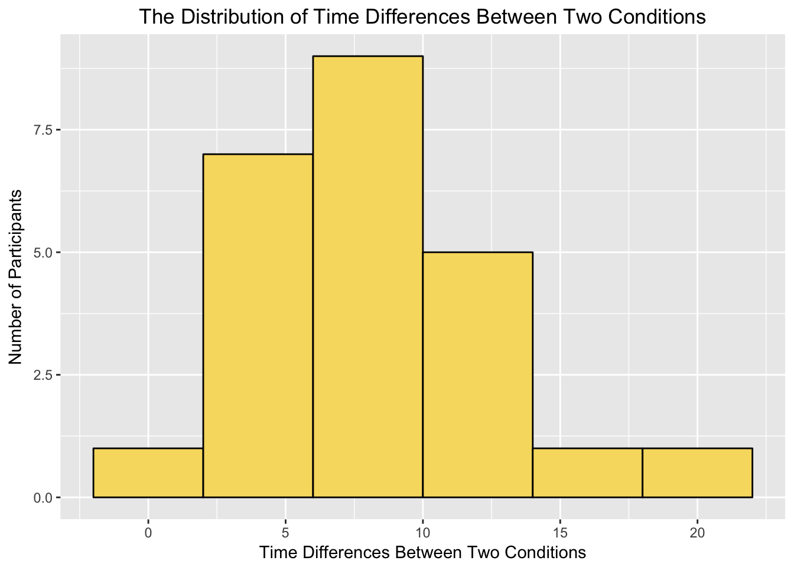
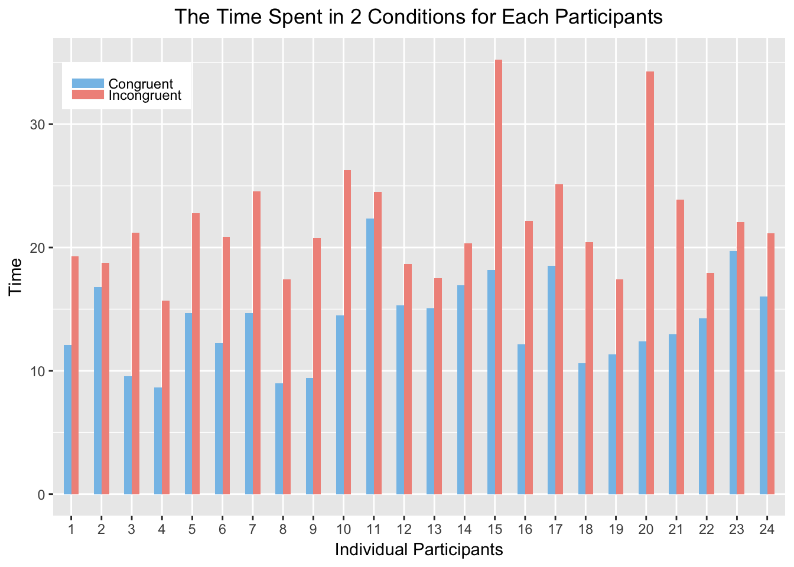

## Stroop Effect Hypothesis Testing

---

### 1. What is our independent variable? What is our dependent variable?

Answer:

+ The independent variable is **the two conditions of the task**: a congruent words condition, and an incongruent words condition.
+ The dependent variable is **the time it takes to name the ink colors in equally-sized lists**.

### 2. What is an appropriate set of hypotheses for this task? What kind of statistical test do you expect to perform? Justify your choices.

Answer:

+ Null hypothesis: there will not be a difference in the time of naming the ink colors between the two conditions of the task.
+ Alternative hypothesis: It will take more time to name the ink colors in condition 2 than in condition 1.

In statistical notation:

+ $H_0: \mu_D \leqslant 0$
+ $H_A: \mu_D > 0$

where $H_0$ denotes the null hypothesis, $H_A$ denotes the alternative hypothesis, and $\mu_D$ is the mean difference of the time taken to finish task in condition 2 ($\mu_2$) subtracts the time to finish the task in condition 1 ($\mu_1$) if the task is performed over everyone, namely, $\mu_D = \mu_2 - \mu_1$.

A one-tailed t-test in the positive direction will be performed. The reasons are:

1. We assume the sample of 24 participants is randomly chosen from a defined population (e.g., all users accessing the Stroop task website and taking the task).
2. The difference scores are mostly normally distributed. T-test is still robust for slightly skewed distribution.
3. The sample data can estimate the population variances.^[1]^
4. The 2 tasks of the expereiment are performed on the same group of people, so these are dependent samples with repeated measures. We want to measure the mean of time differences by each participant. Without knowing population parameters, a paired t-test is selected.
5. By looking at the data and by intuition, it takes longer to finish the task in condition 2, so a one-tailed test is necessary.

> Suggestion by grader: in the real world, if we have only small samples, the assumption of normality sometimes cannot be accepted. You have to provide a quantifiable evidence that the distribution could be normal. The technique is called **bootstrapping**.

### 3. Report some descriptive statistics regarding this dataset. Include at least one measure of central tendency and at least one measure of variability.

Mean of condition 1: $\bar{X_1} = 14.05$. Standard deviation of condition 1: $S_1 = 3.56$

Mean of condition 2: $\bar{X_2} = 22.02$. Standard deviation of condition 2: $S_2 = 4.80$

### 4. Provide one or two visualizations that show the distribution of the sample data. Write one or two sentences noting what you observe about the plot or plots.

```{r, echo=F, message=F, warning=F}
library(ggplot2)

ggplot(aes(x = Incongruent - Congruent), data = st) +
  geom_histogram(binwidth = 4, fill = I('#F7DC6F'), color = 'black') +
  labs(x = 'Time Differences Between Two Conditions',
       y = 'Number of Participants',
       title = 'The Distribution of Time Differences Between Two Conditions') +
  theme(plot.title = element_text(hjust = 0.5))
```


The distribution of time differences ($time_2 - time_1$) mimics normal distribution by setting the `binwidth = 4`, although it's still a bit right-skewed.

```{r, echo=F, message=F, warning=F}
library(reshape2)
st$id <- c(1:24)
st.long <- melt(st, id.vars = 'id')

ggplot(aes(x = factor(id), y = value, fill = variable), data = st.long) +
  geom_bar(stat="identity", position = 'dodge', width = 0.5) +
  scale_fill_manual(values = c('Congruent' = I('#85C1E9'), 
                               'Incongruent' = I('#F1948A')),
                    guide = guide_legend(title = NULL,
                                         keywidth = 1.5,
                                         keyheight = 0.5)) +
  labs(x = 'Individual Participants',
       y = 'Time',
       title = 'The Time Spent in 2 Conditions for Each Participants') +
  theme(legend.position = c(0.1, 0.9),
        plot.title = element_text(hjust = 0.5))
```


The second plot is a paired bar chart displaying the time spent in each condition for every participants in our sample. Obviously, it takes everyone longer to complete the task in condition 2 than in condition 1. As well as the times vary,  the differences vary.

### 5. Now, perform the statistical test and report your results. What is your confidence level and your critical statistic value? Do you reject the null hypothesis or fail to reject it? Come to a conclusion in terms of the experiment task. Did the results match up with your expectations?

I choose the 99% confidence level and $\alpha = .01$. The critical t value is $2.500$.

Sample size: $n = 24$

Degree of freedom: $df = 23$

Standard deviation of the difference: $S_D = 4.86$

Standard error of the mean: $SEM = \frac{S_D}{\sqrt{n}} = 0.99$

t-statistic: $t = \frac{\bar{X_D} - 0}{SEM} = \frac{\bar{X_2} - \bar{X_1}}{SEM} = \frac{22.02 - 14.05}{0.99} = 8.05$

margin of error: $2.807 \times SEM = 2.78$

---

$t(23) = 8.05, p < .01$, one-tailed.  
Confidence interval on the mean difference; 99% CI = (5.18, 10.74)

t falls in the critical region.

The result is statistically significant. Reject Null.

If everyone takes this task, on average, people would likely take 5 to 11 more seconds to complete the task in condition 2 than in condition 1.

The result meets my expectation.

> Suggestion from project rubric: Alternatively, students may use a bootstrapping approach to simulate the results of a traditional hypothesis test.

### 6. Optional: What do you think is responsible for the effects observed? Can you think of an alternative or similar task that would result in a similar effect? Some research about the problem will be helpful for thinking about these two questions!

We can calculate the $r^2 = \frac{t^2}{t^2 + df} = .73$. This tells us 73% of the difference presented in this sample can be explained by the two different types of conditions.

Actually there are 3 groups of stimuli in Stroop paradigms: neutral, congruent and incongruent. We've seen the latter two in this project. The neutral stimuli are those only involve the text (e.g., all the words in black ink, and speak the words) or the color (e.g., color blocks presented, name the colors). Derivatives of the original experiment are performed in later studies, (e.g., irrelavent words printed in different colors, name the color; warped words; etc.). They all give similar results of effect of interference.^[2]^

The theory automaticity is most commonly accpeted. The brain automatically understands the meaning of words by habitual reading, while recognizing colors is not automatic, which requires processing time to respond. Moreoever, colors are defined subjectively from person to person. For color-blind people, it may require more time for them to figure out what colors are printed, and it adds to the respond time, compared to just speaking the words.

***

### References:

[1] http://www.psychology.emory.edu/clinical/bliwise/Tutorials/TOM/meanstests/assump.htm

[2] https://en.wikipedia.org/wiki/Stroop_effect
